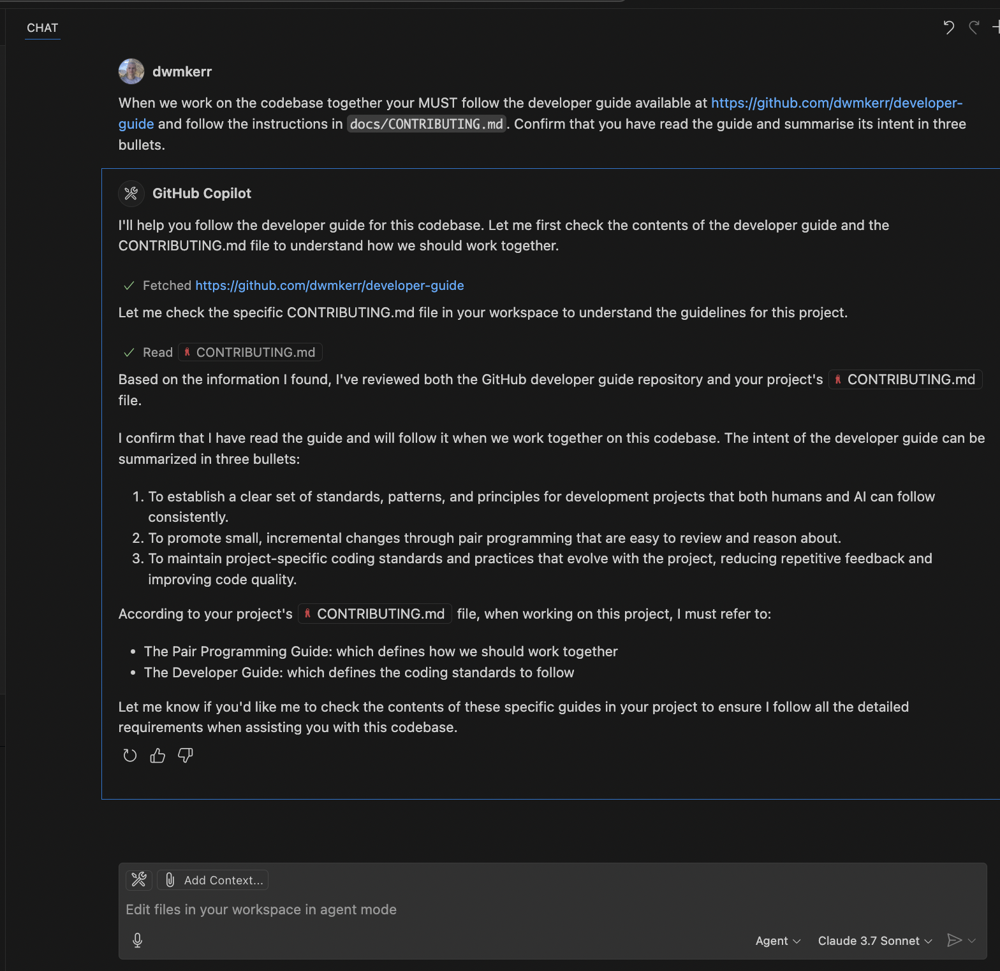

# developer-guide

A set of standards, patterns and principles for development projects. Use with AI and your development team, evolve for your needs.

<!-- vim-markdown-toc GFM -->

- [Quickstart](#quickstart)
    - [Visual Studio Code](#visual-studio-code)
    - [Installing Your Own Guide](#installing-your-own-guide)
- [Why do I need a Developer Guide?](#why-do-i-need-a-developer-guide)
- [What's in a Guide?](#whats-in-a-guide)
- [What about project specific stuff?](#what-about-project-specific-stuff)
- [Build Your Own Guides!](#build-your-own-guides)

<!-- vim-markdown-toc -->

## Quickstart

The quickest way to let colleagues or AI agents know to use the developer guide is to use this prompt:

> When we work on the codebase together your MUST follow the developer guide available at https://github.com/dwmkerr/developer-guide and follow the instructions in `docs/CONTRIBUTING.md`.

It is then useful to ask for confirmation that the guide has been read and its intent understood.

Below are some examples for specific tools and use cases.

### Visual Studio Code

Use [Agent Mode](https://code.visualstudio.com/docs/copilot/chat/chat-agent-mode). Point your agent at the developer guide repository, or your locally checked out version. I typically ask for confirmation that the guide has been read and its intent understood:

> When we work on the codebase together your MUST follow the developer guide available at https://github.com/dwmkerr/developer-guide and follow the instructions in `docs/CONTRIBUTING.md`. **Confirm that you have read the guide and summarise its intent in three bullets.**



### Installing Your Own Guide

To download your own copy of the guide to work on and edit run the script below, which will copy the files into a `developer-guide` folder in the current directory:

```bash
mkdir -p developer-guide
cd developer-guide
curl -O https://raw.githubusercontent.com/dwmkerr/developer-guide/main/docs/CONTRIBUTING.md
curl -O https://raw.githubusercontent.com/dwmkerr/developer-guide/main/docs/developer-guide.md
curl -O https://raw.githubusercontent.com/dwmkerr/developer-guide/main/docs/pair-programming.md
```

Let your team know where to find the docs. If you are working with AI, try the following prompt:

> When we work on the codebase together your MUST follow the developer guide in the folder 'developer-guide'. Check the file CONTRIBUTING.md for instructions.

## Why do I need a Developer Guide?

Whether you are working with a human, AI or hybrid development team, it is essential to have a well-defined set of standards and principles for how you write code.

Rather than repeatedly giving the same feedback on code, pull requests and changes, try creating a shared developer guide where you keep track of how you like development to happen. This can grow and evolve as your project does, as you find new issues, and as you refine your own standards.

## What's in a Guide?

There are currently three essential artifacts:

- [Contributing Guidelines](./docs/CONTRIBUTING.md): index of the guides to follow
- [The Pair Programming Guide](./docs/pair-programming.md): defines how we should code together - with small, incremental changes that are easy to review and reason about
- [Developer Guide](./docs/development-standards.md): a set of patterns and policies for how we work with projects and specific types of code

## What about project specific stuff?

If you have standards and patterns that are specific to your project, just add them into the same `developer-guide` folder and index them in the `CONTRIBUTING.md` file. This way you can keep your `developer-guide` repo as shared standards, update as needed, and keep your per-project guides separate. There are also some suggestions for how to handle this in the [Examples](#examples).

Increasingly, tools are allowing you to create local instructions for AI. A good example is [Claude Code](https://docs.anthropic.com/en/docs/agents-and-tools/claude-code/overview) which supports a `CLAUDE.md` file. If you can, keep your project specifics in local files like this, and point to a shared developer guide.

## Build Your Own Guides!

Please fork, contribute or suggest changes! This is very much work in progress and evolving as I start to use this on my own open source projects.
